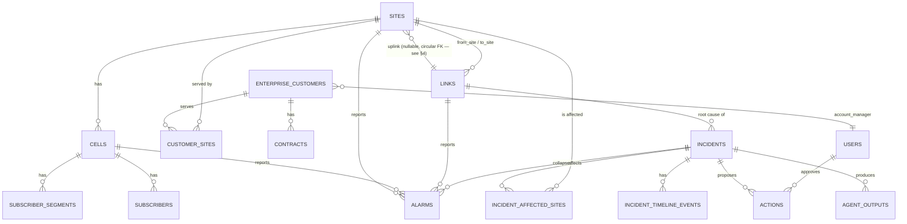

# Signos Data Schema

This is the contract for the data engineer populating Signos's PostgreSQL
database. **There is no mock data or seed script in the application** — every
endpoint reads from and (for system tables) writes to these tables directly.
If a table is empty, the corresponding endpoints return empty results, not
errors — so you can load tables incrementally.

JSON Schema files for every engineer-populated table live in
[`docs/schemas/`](schemas/), generated from the live SQLAlchemy models (see
`scripts/export_schemas.py`) — they can never drift from the real DB schema.
Run that script again after any model change to regenerate them.

## 1. Table ownership

| Table | Filled by | Notes |
|---|---|---|
| `sites` | **Data engineer** | |
| `cells` | **Data engineer** | |
| `links` | **Data engineer** | |
| `subscriber_segments` | **Data engineer** | aggregated counts, not individuals |
| `subscribers` | **Data engineer** | only premium-segment individuals need rows |
| `enterprise_customers` | **Data engineer** | |
| `customer_sites` | **Data engineer** | |
| `contracts` | **Data engineer** | |
| `runbooks` | **Data engineer** | optional but improves the Network agent |
| `market_items` | **Data engineer** | |
| `business_config` | **Data engineer** | optional — sane defaults apply if empty |
| `users` | **Data engineer**, but prefer the API | see note below |
| `alarms` | **Data engineer** (direct insert) **or** `POST /api/v1/alarms/ingest` | operational, not reference data |
| `incidents` | **System only** | never write to this |
| `incident_affected_sites` | **System only** | never write to this |
| `incident_timeline_events` | **System only** | never write to this |
| `actions` | **System only** | never write to this |
| `agent_outputs` | **System only** | never write to this |
| `audit_events` | **System only**, append-only | never write to this |
| `settings` | **System only** (singleton) | change via `PUT /api/v1/settings` |

> **`users` note**: `hashed_password` must be a bcrypt hash — the app never
> hashes on read. Unless you specifically need bulk user provisioning,
> prefer `POST /api/v1/users` (admin-only) so hashing happens correctly and
> an audit event is recorded. The first admin is created automatically from
> `FIRST_ADMIN_EMAIL`/`FIRST_ADMIN_PASSWORD` on startup if no admin exists.

## 2. Columns

UUID primary keys and `created_at`/`updated_at` (`timestamptz`, server-default
`now()`) are omitted below since every table has them identically — they're
present in the JSON Schemas. "Required" means required for a raw SQL
insert — note that several columns (`status`, `is_active`, `is_protected`,
etc.) have an ORM-side Python default that **does not apply to raw SQL**, so
they're listed as required here even though the app can omit them.

### sites
*40 sites across real Baku districts in the reference scenario.*

| Column | Type | Null? | Enum / constraint | Unit | Description |
|---|---|---|---|---|---|
| `name` | string(255) | no | | | Display name |
| `lat`, `lng` | float | no | | degrees | Coordinates |
| `district` | string(255) | no | | | Real Baku district name |
| `uplink_link_id` | uuid | **yes** | FK → `links.id` | | The link this site depends on upstream. Nullable only because of load-order (see §4) — in practice every site should have one so the correlation engine can find it |
| `energy_cost_azn_month` | numeric(12,2) | no | | AZN/month | Used by the Portfolio service |
| `status` | enum | no | `up`, `down` | | Flipped by incidents/resolution — load as `up` |

### cells
| Column | Type | Null? | Enum / constraint | Unit | Description |
|---|---|---|---|---|---|
| `site_id` | uuid | no | FK → `sites.id` | | |
| `technology` | enum | no | `4G`, `5G` | | |
| `revenue_per_min_azn` | numeric(10,4) | no | | AZN/min | Drives the Finance service's revenue-loss ticker |
| `status` | enum | no | `up`, `down` | | Load as `up` |

### links
| Column | Type | Null? | Enum / constraint | Unit | Description |
|---|---|---|---|---|---|
| `from_site_id`, `to_site_id` | uuid | no | FK → `sites.id` | | The two endpoints |
| `type` | enum | no | `fiber`, `microwave` | | |
| `is_protected` | boolean | no | | | **Protected links are never treated as a root cause** by correlation, by design — see §5 |
| `status` | enum | no | `up`, `down` | | Load as `up` |

### subscriber_segments
*Aggregated counts per cell per segment — not individual people.*

| Column | Type | Null? | Enum / constraint | Unit | Description |
|---|---|---|---|---|---|
| `cell_id` | uuid | no | FK → `cells.id` | | |
| `segment` | enum | no | `premium`, `standard`, `budget` | | |
| `count` | integer | no | | subscribers | |
| `arpu_azn` | numeric(10,2) | no | | AZN/month | Average revenue per user (not currently consumed by any service, but part of the contract) |

### subscribers
*Named individuals — only populate premium-segment rows; the Commercial
agent uses these for a sample SMS-recipient list, while `subscriber_segments`
is the authoritative count.*

| Column | Type | Null? | Enum / constraint | Unit | Description |
|---|---|---|---|---|---|
| `home_cell_id` | uuid | no | FK → `cells.id` | | |
| `segment` | enum | no | `premium`, `standard`, `budget` | | |
| `msisdn_masked` | string(32) | no | | | e.g. `+994 XX XXX 01` — never a real, undisguised number |
| `name` | string(255) | **yes** | | | Fictional is fine and expected |

### enterprise_customers
| Column | Type | Null? | Enum / constraint | Unit | Description |
|---|---|---|---|---|---|
| `name` | string(255) | no | | | |
| `sector` | string(255) | no | | | Free text, e.g. `finance`, `healthcare` |
| `account_manager_user_id` | uuid | **yes** | FK → `users.id` | | The account_manager-role user who owns this account |

### customer_sites
*Many-to-many: which sites serve which customers, and how.*

| Column | Type | Null? | Enum / constraint | Unit | Description |
|---|---|---|---|---|---|
| `customer_id` | uuid | no | FK → `enterprise_customers.id` | | |
| `site_id` | uuid | no | FK → `sites.id` | | |
| `service_type` | enum | no | `leased_line`, `private_apn`, `mobile` | | |

Unique on `(customer_id, site_id, service_type)`.

### contracts
| Column | Type | Null? | Enum / constraint | Unit | Description |
|---|---|---|---|---|---|
| `customer_id` | uuid | no | FK → `enterprise_customers.id` | | |
| `type` | enum | no | `enterprise_sla`, `tower_lease`, `interconnect`, `vendor_sla` | | |
| `restore_within_min` | integer | no | | minutes | SLA restore window |
| `penalty_per_started_hour_azn` | numeric(12,2) | no | | AZN/hour | Billed per **started** hour over the deadline (a 1-minute overage bills a full hour) |
| `penalty_cap_azn` | numeric(12,2) | no | | AZN | Absolute ceiling — also the "worst case" figure |
| `clause_text` | text | no | | | Free text, source for the Contracts agent |
| `valid_from` | date | no | | | |
| `valid_to` | date | **yes** | | | Null = still active |

### runbooks
*Optional, but improves the Network agent's output quality.*

| Column | Type | Null? | Enum / constraint | Unit | Description |
|---|---|---|---|---|---|
| `title` | string(255) | no | | | |
| `failure_type` | string(100) | no | | | Free text — matched against the **dominant `alarms.type`** value in an incident (see §5 for suggested values) |
| `steps` | jsonb array | no | | | List of strings, e.g. `["Dispatch field crew", "Verify splice point", ...]` |

### market_items
| Column | Type | Null? | Enum / constraint | Unit | Description |
|---|---|---|---|---|---|
| `type` | enum | no | `competitor_tariff`, `regulator`, `spectrum` | | |
| `title` | string(255) | no | | | |
| `summary` | text | no | | | |
| `source` | string(255) | no | | | Publication/origin name |
| `published_at` | timestamptz | no | | | |

### business_config
*Key-value business constants. Optional — if a key is absent, the service
layer falls back to an in-code default so nothing crashes, but the DB value
always wins once present.*

| Column | Type | Null? | Enum / constraint | Unit | Description |
|---|---|---|---|---|---|
| `key` | string(100) | no | unique | | See the table below for recognized keys |
| `value` | text | no | | | Stored as text; parsed as float/int by the consuming service |
| `description` | text | **yes** | | | |

Recognized keys and their in-code fallback if the row is absent:

| Key | Fallback | Used by |
|---|---|---|
| `sla_at_risk_threshold_min` | `60` | SLA compliance status (`ok`/`at_risk`/`breached`) |
| `compensation_per_subscriber_azn` | `2.0` | Commercial compensation cost |
| `portfolio_upgrade_ratio_threshold` | `3.0` | Portfolio recommendation |
| `portfolio_upgrade_traffic_threshold` | `200` | Portfolio recommendation |
| `portfolio_keep_ratio_threshold` | `1.0` | Portfolio recommendation |
| `portfolio_consolidate_ratio_threshold` | `0.3` | Portfolio recommendation |

### users
| Column | Type | Null? | Enum / constraint | Unit | Description |
|---|---|---|---|---|---|
| `email` | string(255) | no | unique | | Must pass RFC email validation **and** not be on a reserved-TLD list (`.local`, `.test`, `.invalid`, `.example`, …) if created through the API |
| `hashed_password` | string(255) | no | | | bcrypt hash — see note in §1 |
| `role` | enum | no | `admin`, `engineer`, `account_manager`, `viewer` | | |
| `is_active` | boolean | no | | | Load as `true` |

### alarms
*Operational, not reference data — pushed continuously, not a one-time load.*

| Column | Type | Null? | Enum / constraint | Unit | Description |
|---|---|---|---|---|---|
| `timestamp` | timestamptz | no | | | When the alarm fired |
| `site_id` | uuid | no | FK → `sites.id` | | |
| `cell_id` | uuid | **yes** | FK → `cells.id` | | |
| `link_id` | uuid | **yes** | FK → `links.id` | | |
| `severity` | enum | no | `critical`, `major`, `minor`, `warning` | | |
| `type` | string(100) | no | | | Free text — matched against `runbooks.failure_type`; see §5 for suggested values |
| `processed` | boolean | no | | | Load as `false` — the system flips this |
| `incident_id` | uuid | **yes** | FK → `incidents.id` | | System-assigned; leave null |

### System-generated tables (reference only — never write to these)

- **`incidents`**: `root_cause_link_id` (FK → links), `root_cause_summary`, `status` (`open`/`resolved`), `started_at`, `eta_at`, `resolved_at`.
- **`incident_affected_sites`**: `incident_id` (FK), `site_id` (FK). Unique on the pair.
- **`incident_timeline_events`**: `incident_id` (FK), `ts`, `label` (e.g. `alarms_received`, `correlated`, `eta_updated`, `resolved`), `detail`.
- **`actions`**: `incident_id` (FK), `agent` (`network`/`contracts`/`finance`/`commercial`), `proposal`, `owner_role`, `status` (`proposed`/`approved`/`rejected`/`executed`), `risk_level` (`low`/`medium`/`high`), `sources` (jsonb list of `{table, id}`), `approved_by_user_id` (FK → users, nullable), `approved_at` (nullable).
- **`agent_outputs`**: `incident_id` (FK), `agent`, `output` (jsonb), `source` (`live`/`fallback`), `model`, `tokens` (nullable), `latency_ms` (nullable).
- **`audit_events`**: `timestamp`, `actor_user_id` (FK, nullable for system actions), `actor_role` (nullable), `event_type`, `entity`, `entity_id` (nullable, no FK — polymorphic), `details` (jsonb). No `created_at`/`updated_at` — append-only by convention, enforced at the application layer, not a DB trigger.
- **`settings`**: singleton, `autonomy_level` (`recommend_only`/`approve_to_act`/`auto_low_risk`).

## 3. Relationships and ER diagram



(`business_config`, `runbooks`, `market_items`, `settings`, and
`audit_events` are standalone / polymorphic and omitted from the diagram for
readability — `audit_events.entity_id` is an untyped UUID that can point at
any table, by design, so it carries no FK.)

## 4. Load order

`sites` and `links` have a **circular foreign key** (a link references two
sites; a site references its upstream link). Load in this order:

1. `users` (needed for `enterprise_customers.account_manager_user_id`)
2. `sites` — **with `uplink_link_id` left `NULL`**
3. `links` — now the referenced sites exist
4. `UPDATE sites SET uplink_link_id = ... WHERE id = ...` — one statement per site
5. `cells`
6. `subscriber_segments`, `subscribers`
7. `enterprise_customers`
8. `customer_sites`, `contracts`
9. `runbooks`, `market_items`, `business_config` (any order, independent of the above)
10. `alarms` (only after the topology above exists — every `alarms.site_id` must reference a real site)

(This is the same circular-FK shape the app's own Alembic migration had to
special-case — see the README's note on it.)

## 5. Business rules the data must satisfy

- **Every site should have an `uplink_link_id`.** A site with none can never
  be the target of correlation (there's no link whose failure would explain
  its alarms) — it'll just generate alarms nobody ever groups into an
  incident.
- **Every cell belongs to exactly one site** (`cells.site_id` not null) —
  already enforced by the FK, but worth stating: a site with zero cells has
  no revenue and contributes nothing to Finance/Portfolio.
- **At least one link must be unprotected (`is_protected = false`)** for the
  demo scenario to produce an incident at all — correlation explicitly
  refuses to treat a protected link as a root cause, by design (protected
  links shouldn't take down downstream sites in the first place).
- **Enterprise customers must be linked to sites via `customer_sites`**, and
  have at least one contract, for the Impact/SLA/Finance story to show
  anything for them. A customer with no `customer_sites` row is invisible to
  every incident regardless of contracts.
- **Revenue values should be at a realistic scale.** `cells.revenue_per_min_azn`
  in the few-AZN-per-minute range per cell is what produces a believable
  "₼38/min" style figure when several cells are affected — values orders of
  magnitude off will make the Finance numbers look obviously synthetic.
- **`alarms.type` and `runbooks.failure_type` should share a vocabulary** so
  the Network agent's runbook lookup actually matches something. Suggested
  values: `link_down`, `cell_down`, `high_vswr`, `power_failure`,
  `transmission_degraded`. There's no DB-level enum constraining this
  (deliberately — real alarm taxonomies vary too much to hardcode), so
  consistency here is a data-quality concern, not a schema one.
- **`alarms.severity` is a closed enum** (`critical`/`major`/`minor`/`warning`)
  unlike `type` — this was an assumption made in the absence of a specified
  vocabulary; flag if your source system uses different severities.

## 6. One realistic example row per table

```sql
-- users
INSERT INTO users (id, email, hashed_password, role, is_active, created_at, updated_at)
VALUES ('a1111111-0000-0000-0000-000000000001', 'amanager@signos.app',
        '$2b$12$examplehashreplacewithrealbcrypt', 'account_manager', true, now(), now());

-- sites (uplink_link_id NULL for now -- see load order)
-- Nasimi Hub has no uplink of its own (it's the upstream end of the link below)
INSERT INTO sites (id, name, lat, lng, district, uplink_link_id, energy_cost_azn_month, status, created_at, updated_at)
VALUES ('51111111-0000-0000-0000-000000000002', 'Nasimi Hub', 40.4, 49.8,
        'Nasimi', NULL, 500.00, 'up', now(), now());

INSERT INTO sites (id, name, lat, lng, district, uplink_link_id, energy_cost_azn_month, status, created_at, updated_at)
VALUES ('51111111-0000-0000-0000-000000000001', 'Binagadi Site 1', 40.45697, 49.7887,
        'Binagadi', NULL, 620.02, 'up', now(), now());

-- links
INSERT INTO links (id, from_site_id, to_site_id, type, is_protected, status, created_at, updated_at)
VALUES ('61111111-0000-0000-0000-000000000001',
        '51111111-0000-0000-0000-000000000002', -- Nasimi hub site
        '51111111-0000-0000-0000-000000000001', -- Binagadi Site 1
        'fiber', false, 'up', now(), now());

-- back-fill the site's uplink now that the link exists
UPDATE sites SET uplink_link_id = '61111111-0000-0000-0000-000000000001'
WHERE id = '51111111-0000-0000-0000-000000000001';

-- cells
INSERT INTO cells (id, site_id, technology, revenue_per_min_azn, status, created_at, updated_at)
VALUES ('71111111-0000-0000-0000-000000000001', '51111111-0000-0000-0000-000000000001',
        '4G', 1.4100, 'up', now(), now());

-- subscriber_segments
INSERT INTO subscriber_segments (id, cell_id, segment, count, arpu_azn, created_at, updated_at)
VALUES ('81111111-0000-0000-0000-000000000001', '71111111-0000-0000-0000-000000000001',
        'premium', 89, 50.00, now(), now());

-- subscribers (premium only)
INSERT INTO subscribers (id, home_cell_id, segment, msisdn_masked, name, created_at, updated_at)
VALUES ('91111111-0000-0000-0000-000000000001', '71111111-0000-0000-0000-000000000001',
        'premium', '+994 50 XXX 01 23', 'Ada Lovelace', now(), now());

-- enterprise_customers
INSERT INTO enterprise_customers (id, name, sector, account_manager_user_id, created_at, updated_at)
VALUES ('a2222222-0000-0000-0000-000000000001', 'AtaBank HQ', 'finance',
        'a1111111-0000-0000-0000-000000000001', now(), now());

-- customer_sites
INSERT INTO customer_sites (id, customer_id, site_id, service_type, created_at, updated_at)
VALUES ('a3333333-0000-0000-0000-000000000001', 'a2222222-0000-0000-0000-000000000001',
        '51111111-0000-0000-0000-000000000001', 'leased_line', now(), now());

-- contracts
INSERT INTO contracts (id, customer_id, type, restore_within_min, penalty_per_started_hour_azn,
                        penalty_cap_azn, clause_text, valid_from, valid_to, created_at, updated_at)
VALUES ('a4444444-0000-0000-0000-000000000001', 'a2222222-0000-0000-0000-000000000001',
        'enterprise_sla', 180, 2000.00, 30000.00,
        'Operator shall restore service within 180 minutes of a qualifying outage, '
        'or pay AZN 2,000 per started hour thereafter, capped at AZN 30,000.',
        '2026-01-01', NULL, now(), now());

-- runbooks
INSERT INTO runbooks (id, title, failure_type, steps, created_at, updated_at)
VALUES ('a5555555-0000-0000-0000-000000000001', 'Fiber link down — field response', 'link_down',
        '["Dispatch field crew to the last known splice point",
          "Verify optical power at both ends",
          "Re-splice or replace the damaged segment",
          "Confirm link status before closing the ticket"]'::jsonb,
        now(), now());

-- market_items
INSERT INTO market_items (id, type, title, summary, source, published_at, created_at, updated_at)
VALUES ('a6666666-0000-0000-0000-000000000001', 'regulator', 'Spectrum auction announced',
        'The Ministry of Digital Development announced a 700MHz band auction for Q1.',
        'Ministry of Digital Development', now(), now(), now());

-- business_config
INSERT INTO business_config (id, key, value, description, created_at, updated_at)
VALUES ('a7777777-0000-0000-0000-000000000001', 'compensation_per_subscriber_azn', '2.0',
        'AZN data-bonus compensation per affected premium subscriber', now(), now());

-- alarms (operational -- see §7)
INSERT INTO alarms (id, timestamp, site_id, cell_id, link_id, severity, type, processed, incident_id, created_at, updated_at)
VALUES ('a8888888-0000-0000-0000-000000000001', now(), '51111111-0000-0000-0000-000000000001',
        '71111111-0000-0000-0000-000000000001', '61111111-0000-0000-0000-000000000001',
        'critical', 'link_down', false, NULL, now(), now());
```

## 7. Pushing alarms and what triggers processing

Two equally valid paths — pick whichever fits your pipeline:

1. **`POST /api/v1/alarms/ingest`** (requires an `engineer` or `admin` token,
   rate-limited). Body: `{"alarms": [{"timestamp", "site_id", "cell_id"?,
   "link_id"?, "severity", "type"}, ...]}`. Correlation runs **synchronously**
   as part of this request, and if an incident results, the SI agents run as
   a background task immediately after the response is sent.
2. **Direct DB insert** (`INSERT INTO alarms (...) VALUES (...)`, with
   `processed = false`). A background worker polls for unprocessed alarms
   every `ALARM_WORKER_POLL_SECONDS` (default 5s) and runs the exact same
   correlation + agent pipeline. This is the path for a real alarm-forwarding
   pipeline that writes straight to Postgres.

**What correlation does**: groups unprocessed alarms by the upstream link of
the site that reported them, picks the link shared by the most sites
(skipping any `is_protected` link), marks every site behind that link as
affected — not just the ones that happened to alarm yet — and either creates
a new incident or attaches to an already-open one for the same root-cause
link. This is why alarms can be pushed in multiple batches over time: a
second batch for the same ongoing outage attaches to the existing incident
instead of creating a duplicate.
